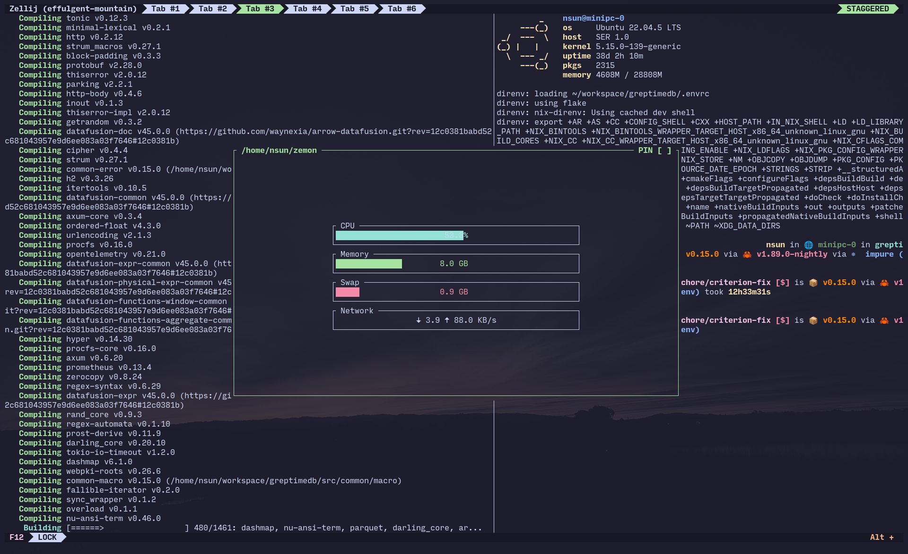

# zemon

A small TUI widget designed for display system information in zellij.



## Installation

### Using Nix Flakes

#### Direct installation
```bash
nix profile install github:sunng87/zemon
```

#### Run without installing
```bash
nix run github:sung87/zemon
```

### NixOS Configuration

Add to your `configuration.nix`:

```nix
{
  inputs = {
    nixpkgs.url = "github:NixOS/nixpkgs/nixos-unstable";
    zemon.url = "github:sunng87/zemon";
  };

  outputs = { self, nixpkgs, zemon, ... }: {
    nixosConfigurations.YOUR_USERNAME = nixpkgs.lib.nixosSystem {
      system = "x86_64-linux";
      modules = [
        {
          environment.systemPackages = [
            zemon.packages.x86_64-linux.default
          ];
        }
      ];
    };
  };
}
```

### Home Manager

Add to your `home.nix`:

```nix
{
  inputs = {
    nixpkgs.url = "github:NixOS/nixpkgs/nixos-unstable";
    home-manager.url = "github:nix-community/home-manager";
    zemon.url = "github:sunng87/zemon";
  };

  outputs = { nixpkgs, home-manager, zemon, ... }: {
    homeConfigurations.YOUR_USERNAME = home-manager.lib.homeManagerConfiguration {
      pkgs = nixpkgs.legacyPackages.x86_64-linux;
      modules = [
        {
          home.packages = [
            zemon.packages.x86_64-linux.default
          ];
        }
      ];
    };
  };
}
```

## Development

### Using the development shell
```bash
nix develop
cargo run
```

### Building locally
```bash
nix build
```
